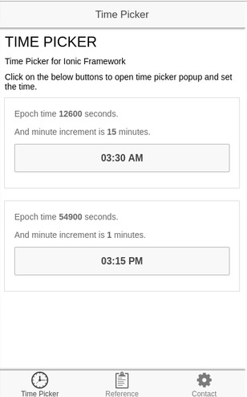
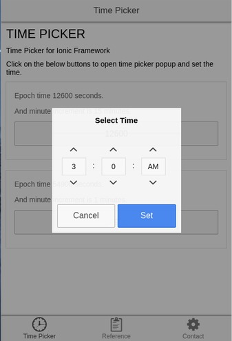

##Introduction:

This application is built for time picker, which can be used in Ionic Framework.
All you need to do is just pass the Epoch time to the 'ng-model' and call the function on 'ng-click'.

##Follow the below mentioned steps.

1) First, install Node.js.

2) Run the following command from command prompt.

    > npm install -g cordova ionic

##Project Setup:

1) Move to any folder/workspace from command prompt, using the following command

    > cd DirectoryName

2) Type the following command and press enter.

	> git clone https://github.com/rajeshwarpatlolla/TimePickerForIonicFramework.git

3) Now you will see a message "Cloning into 'TimePickerForIonicFramework'...". Move to "TimePickerForIonicFramework" directory.

    > cd TimePickerForIonicFramework

4) use the following command to run the application.

	> ionic serve

##Versions:

### 1) v0.1.0
12 hour time picker has been added.

### 2) v0.2.0
12 hour time picker functionality modified.

### 3) v0.3.0
24 hour time picker has been added.

##Screen Shots:

